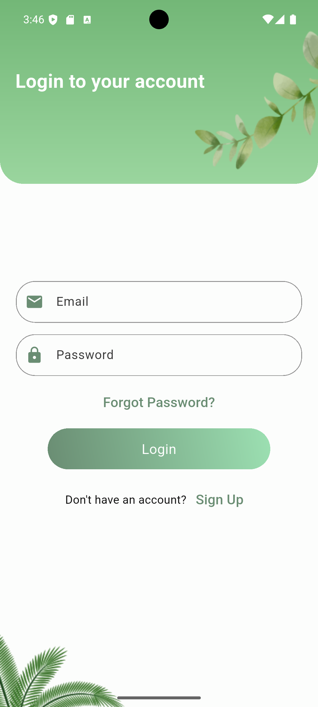

#  Gharas-Saudi Smart Plant Recommendation App  

Gharas is an innovative mobile application that helps users discover the perfect plants for their specific location in Saudi Arabia. Combining geolocation technology with AI-powered visualization, Gharas offers:  

- **Smart Plant Recommendations**: Get personalized plant suggestions based on your exact location's environment  
- **AI-Powered Simulation**: Visualize how any plant would look in your space using advanced image generation  
- **Saudi Flora Database**: Comprehensive information about native plants and their ideal growing conditions  

##  Key Features  

###  Location-Based Plant Recommendations  
- Drop a pin on the map to analyze soil, climate, and environmental factors  
- Receive customized plant suggestions that will thrive in your selected location  
- Filter recommendations by plant type (flowers, trees, shrubs etc.) and maintenance level  

###  AI Plant Simulation  
- Take or upload a photo of your garden/space  
- Select any plant from our database  
- Generate realistic AI visuals of how the plant would look in your actual environment  
- Adjust plant size, quantity, and arrangement  

###  Plant Knowledge Hub  
- Detailed profiles for hundreds of Saudi-native plants  
- Care guides with watering schedules and sunlight requirements  
- Seasonal planting recommendations  

##  Technical Stack  

- **Frontend**: Flutter (iOS & Android)  
- **Backend**: Firebase (Auth, Firestore, Cloud Functions)  
- **AI Services**: Custom image generation models  
- **Maps**: Google Maps API with custom environmental data layers  
- **State Management**: Riverpod  


## Requirements
Create a `.env` file based on `.env.example`:

```plaintext
MAP_BOX_API_KEY=YOUR_MAP_BOX_API_KEY
```


## Screenshots

<table>
  <tr>
    <td></td>
    <td></td>
    <td></td>
     <td></td>
      <td></td>
    <td></td>
  </tr>
  <tr>
    <td></td>
    <td></td>
    <td></td>
    <td></td>
  </tr>
</table>